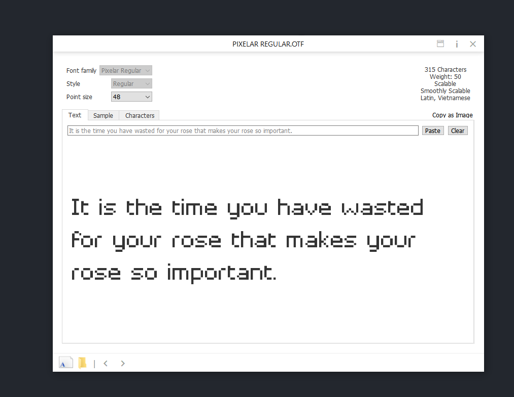
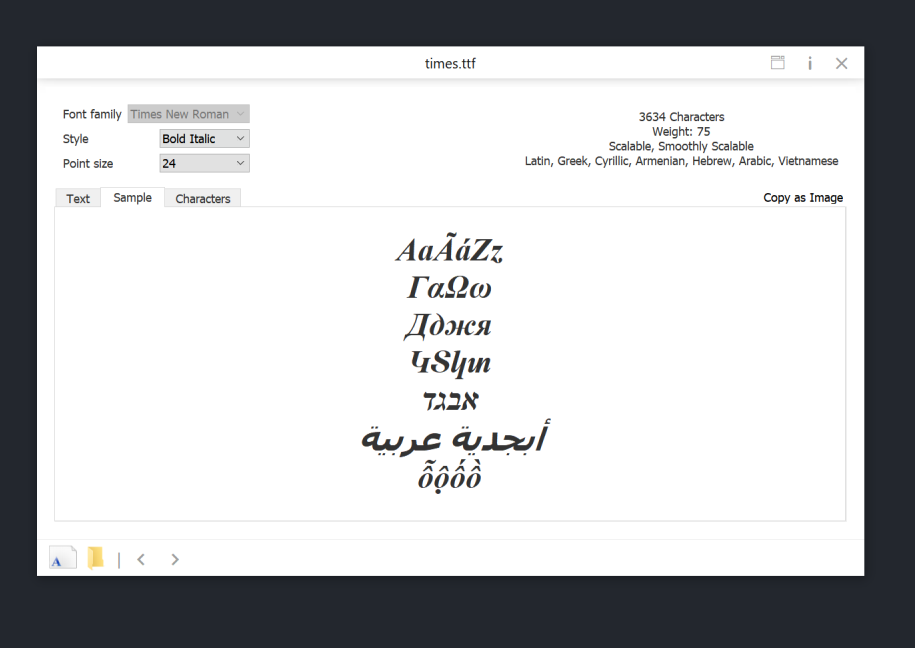
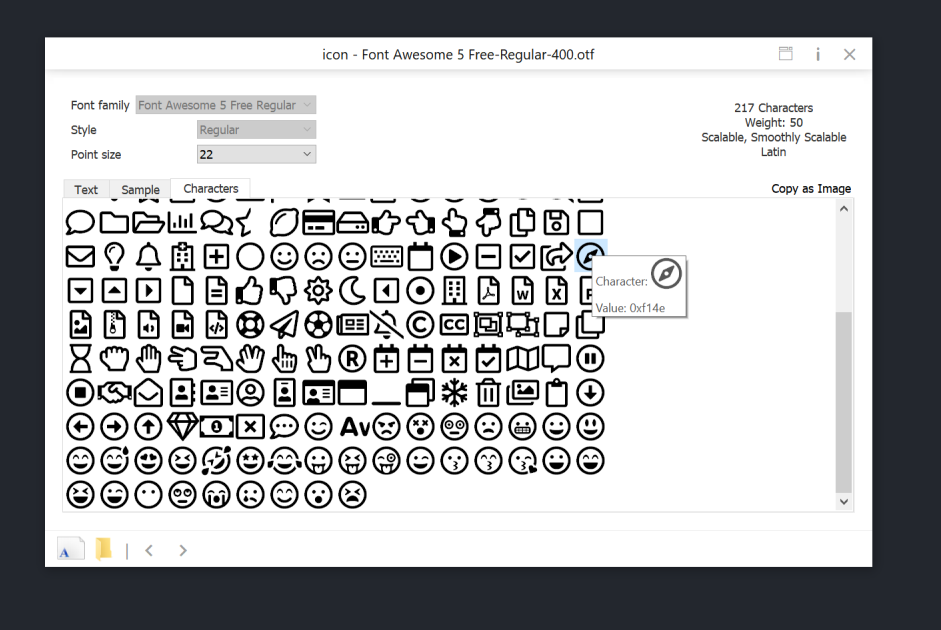

# FontViewer

## Screenshots







## Building and Running

To build and run FontViewer:

1. **Clone the Repository**

   ```bash
   git clone --recursive https://github.com/ccseer/FontViewer.git
   ```
2. **Open `FontViewer.pro`**
   - ```bash
        # TEMPLATE = lib
        # CONFIG += plugin
        # TARGET_EXT = .dll
        SOURCES += src/test.cpp
        ```
   - Build as exe
3. **Open the Project**

    Open FontViewer.pro with your preferred Qt development environment.

4. **Build and Run**

    Compile and run the project within the Qt environment.


## Seer Plugin

Developed as a DLL plugin for Seer 4.0.0


## TODO:
- filter Space key for combobox