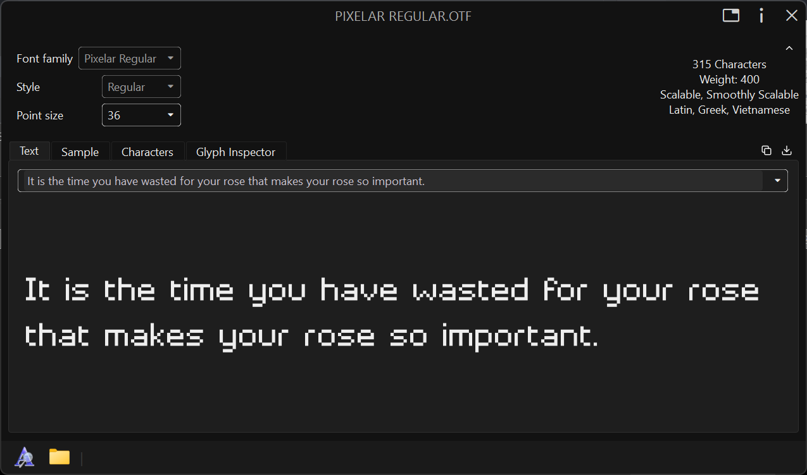
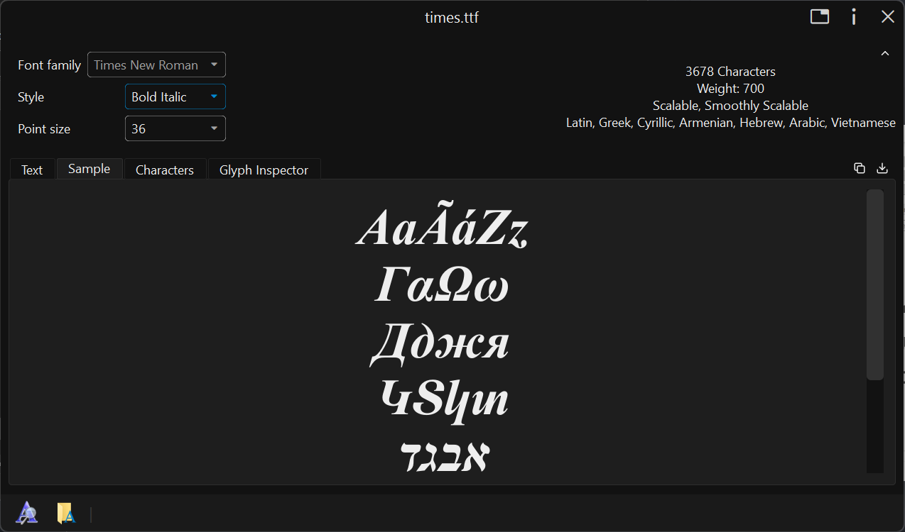
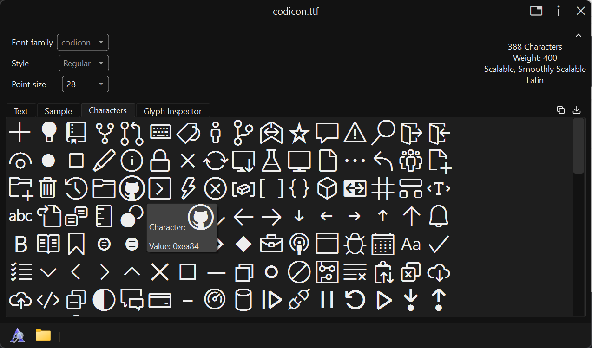
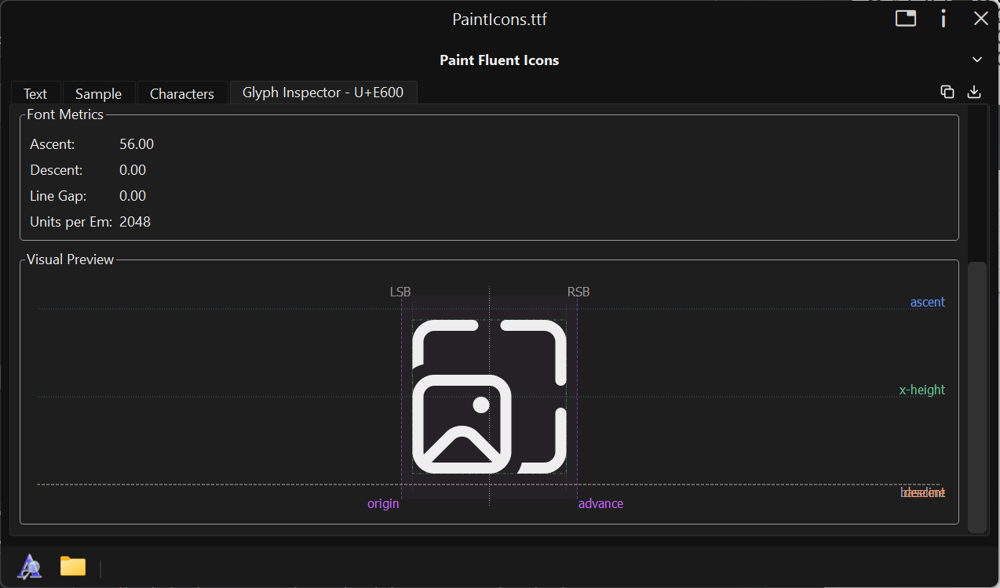

# FontViewer — a Seer Plugin for Previewing Fonts

FontViewer is a fast, native font preview plugin for [Seer](https://1218.io) — the original and fastest Quick Look tool for Windows. Seer pioneered instant file preview on the platform, and FontViewer extends it so you can preview font files with zero lag: drop any font into Seer and instantly see a full glyph table, inspect per-character metrics, preview sample text, and browse metadata — no heavy font manager needed.

## Features

- **Quick font preview** in Seer — press Space on any `.ttf`, `.otf`, `.woff`, `.woff2`, `.ttc`, or `.otc` file
- **Glyph table** showing every Unicode codepoint the font covers
- **Glyph Inspector** with per-glyph metrics: advance width, bounding box, left/right bearings, and a visual preview with annotated guide lines
- **Sample text rendering** with editable pangram presets at any point size
- **OpenType name table** — copyright, family, subfamily, designer, license, and more
- **Font metrics** — ascent, descent, line gap, units-per-em
- **Copy as image** and **Save as SVG**
- **Dark and light theme** support matching Seer's appearance
- **Remembers** your last-used text, size, and layout preferences

## The Fastest Font Preview on Windows

Seer is the **first** and **fastest** Quick Look tool on Windows — it brought instant file preview to the platform before anyone else. Press Space on any file and get an immediate preview with no startup delay. FontViewer brings that same speed to font files, making it the best way to browse and inspect fonts on Windows without launching a resource-heavy editor.

## Screenshots






## Building and Running

Requirements: Qt 6.8, CMake 3.16+.

1. **Clone the Repository**

   ```bash
   git clone --recursive https://github.com/ccseer/FontViewer.git
   cd FontViewer
   ```

2. **Build**

   ```bash
   cd src
   cmake -B build
   cmake --build build
   ```

   This produces two outputs:
   - `fontviewer.dll` — the Seer plugin
   - `test_fontviewer.exe` — standalone viewer for testing

3. **Install the plugin**

   Copy `fontviewer.dll` to your Seer plugins directory.

## Seer Plugin

FontViewer is a file preview plugin for [Seer](https://1218.io) — the original and fastest Quick Look tool for Windows.

- Supports previewing `.ttf`, `.otf`, `.woff`, `.woff2`, and other font formats
- Displays full glyph table, metadata, and Unicode coverage
- Renders sample text with the selected font at configurable sizes
- Built as a native DLL plugin for Seer 4.0.0+

Visit [1218.io](https://1218.io) to download Seer and learn more about the plugin ecosystem.
