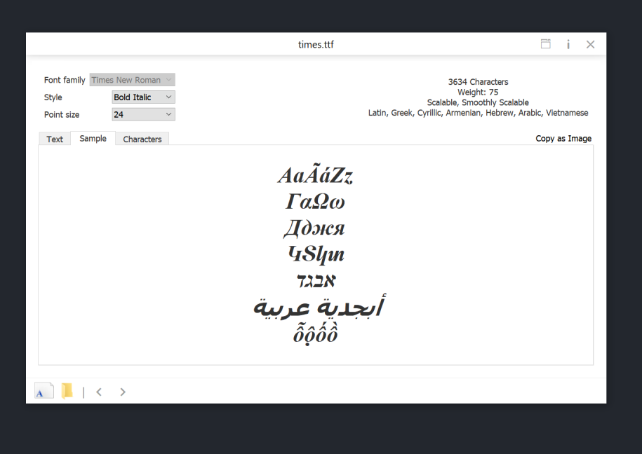
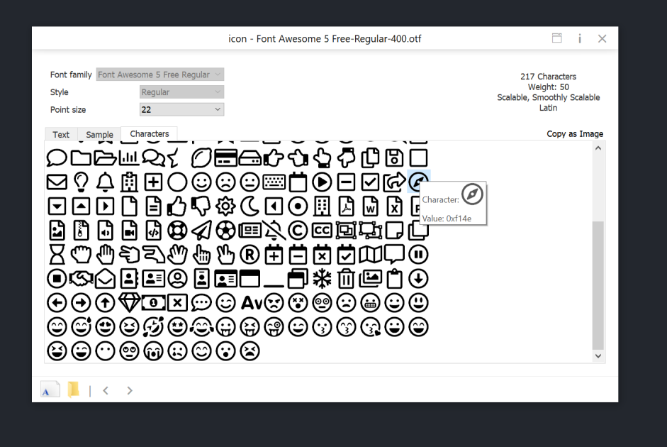

# FontViewer

## Screenshots







## Building and Running

Requirements: Qt 6.8, CMake 3.16+.

1. **Clone the Repository**

   ```bash
   git clone --recursive https://github.com/ccseer/FontViewer.git
   cd FontViewer
   ```

2. **Build**

   ```bash
   cd src
   cmake -B build
   cmake --build build
   ```

   This produces two outputs:
   - `fontviewer.dll` — the Seer plugin
   - `test_fontviewer.exe` — standalone viewer for testing

3. **Install the plugin**

   Copy `fontviewer.dll` to your Seer plugins directory.

## Seer Plugin

FontViewer is a file preview plugin for [Seer](https://1218.io) — a quick-look tool for Windows.

- Supports previewing `.ttf`, `.otf`, `.woff`, `.woff2`, and other font formats
- Displays full glyph table, metadata, and Unicode coverage
- Renders sample text with the selected font at configurable sizes
- Built as a native DLL plugin for Seer 4.0.0+

Visit [1218.io](https://1218.io) to download Seer and learn more about the plugin ecosystem.
